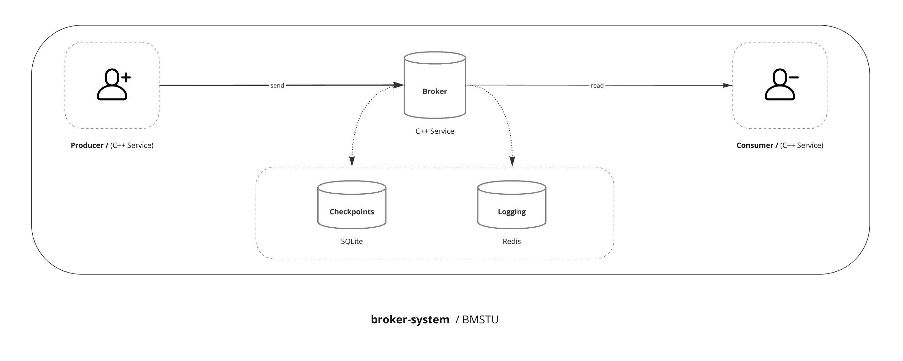

# C++ Video Event Processing with Docker — Distributed Broker System

*If you're looking for the English then check out ->* [README_ENG.md](README_ENG.md)

## Описание

Этот проект посвящён потоковой распределённой обработке данных на примере видеохостинга. Цель — реализовать упрощённую версию системы брокера сообщений, вдохновлённую архитектурой Apache Kafka и RabbitMQ, с использованием языка программирования C++ и контейнеризации через Docker.

### Концепция

Система моделирует работу реального видеохостинга, где множество пользователей взаимодействуют с видеоконтентом и генерируют поток мета-событий. Эти события передаются через самописный брокер сообщений, обрабатываются, логируются и сохраняются для дальнейшего использования.

### Архитектура

Проект реализован в виде микросервисной архитектуры и состоит из следующих компонентов (ниже представлена схема):

- **Producers** — сервисы, имитирующие действия пользователей. Генерируют события, такие как:
  - Просмотры видео
  - Лайки / дизлайки
  - Комментарии
  - Длительность просмотра
  - Метаданные и временные метки

- **Broker** — центральный компонент системы:
  - Использует кольцевой буфер для хранения сообщений в памяти
  - Поддерживает ограничение на размер очереди (с возможностью блокировки при переполнении)
  - Блокирует запись, если нет активных потребителей
  - Периодически сохраняет состояние (чекпоинты) в персистентную БД

- **Consumers** — сервисы, которые считывают события из брокера и выполняют задачи:
  - Сбор и отображение статистики
  - Агрегация метрик
  - Реалтайм-аналитика для блогеров

- **Redis** — используется для логирования и мониторинга событий в реальном времени.

- **SQLite** — персистентное хранилище, в которое брокер периодически сохраняет своё состояние (чекпоинты) для восстановления после сбоев.



### Сценарий нагрузки

Система симулирует работу небольшого видеохостинга:

- **1 000 видео**
- **10 блогеров**
- **1 000 000 пользователей**
- Пользователи случайным образом взаимодействуют с видео, создавая десятки миллионов событий

Такая нагрузка позволяет протестировать, как брокер справляется с параллельной записью, переполнением буфера и сохранением состояния.

### Цели проекта

- Изучить принципы построения распределённой очереди сообщений
- Реализовать многопоточную синхронизацию и передачу данных между сервисами на C++
- Смоделировать реальный пайплайн данных видеохостинга
- Контейнеризовать систему с помощью Docker для масштабируемости и модульности

## Техническое задание:

1. **Очередь сообщений**  
   Реализовать канал передачи данных с функциональностью очереди и ограничением на размер буфера. При достижении лимита запись должна блокироваться.

2. **Интерфейс записи и чтения**  
   Создать библиотеку/класс, позволяющий записывать данные в очередь и считывать их. Поддержка шаблонов (templates) для универсальности.

3. **Кольцевой буфер**  
   Очередь реализуется на основе кольцевого буфера в памяти.

4. **Блокирующая запись при отсутствии потребителя**  
   Если размер буфера не задан (динамический режим), и в системе нет активного Consumer'а, запись блокируется до появления считывателя.

5. **Итераторный интерфейс**  
   Предоставить доступ к очереди через пользовательский итератор (с поддержкой `iter` и `next`), для удобства обработки потока данных.

6. **Сохранение состояния (чекпоинты)**  
   Реализовать возможность периодического сохранения состояния очереди на диск (в SQLite), с возможностью восстановления при сбое.

7. **Контейнеризация через Docker**  
   Все компоненты (Producers, Broker, Consumers, Redis, SQLite) должны разворачиваться в отдельных контейнерах через `docker-compose`.

8. **Логирование через Redis**  
   Все события (входящие, исходящие, ошибки и метаинформация) логируются в Redis для возможности мониторинга и отладки.

9. **Производительность и потокобезопасность**  
   Система должна обеспечивать корректную работу при параллельной записи и чтении, с защитой от гонок данных и deadlock'ов.

## Описание микросервисов

### 1. Producer

**Роль:** Эмулирует действия пользователей видеохостинга.

**Функциональность:**
- Генерирует случайные события: просмотры, лайки, комментарии, длительность и др.
- Отправляет сообщения в Broker по TCP или через IPC.
- Может запускаться в нескольких экземплярах для имитации высокой нагрузки.

**Тип событий:**
```json
{
  "user_id": 158293,
  "video_id": 731,
  "event": "like",
  "timestamp": "2025-05-13T14:12:00Z"
}
```

### 2. Broker

**Роль:** Центральный элемент системы — очередь сообщений.

**Функциональность:**
- Хранит события в кольцевом буфере.
- Контролирует размер буфера и блокирует запись при его переполнении.
- Обеспечивает многопоточную синхронизацию между Producer и Consumer.
- Предоставляет итераторный интерфейс (`iter`, `next`) для чтения данных.
- Сохраняет состояние (чекпоинты) в SQLite для восстановления после сбоев.
- Логирует все события в Redis.
- Блокирует запись при отсутствии активных потребителей (если режим без ограничения размера).

### 3. Consumer

**Роль:** Получает сообщения от Broker и обрабатывает их.

**Функциональность:**
- Читает события из брокера с помощью итератора.
- Выполняет обработку: подсчёт просмотров, лайков, анализ длительности и др.
- Выводит агрегированные данные в stdout или сохраняет в хранилище.
- Масштабируется за счёт запуска нескольких контейнеров.

### 4. Redis Logger

**Роль:** Централизованное логирование всех операций.

**Функциональность:**
- Получает лог-сообщения от всех микросервисов.
- Хранит события по категориям (входящие, исходящие, ошибки).
- Может использоваться для подключения внешней системы мониторинга (например, Grafana).

### 5. SQLite Storage

**Роль:** Персистентное хранилище состояния брокера.

**Функциональность:**
- Хранит текущие чекпоинты очереди (offset, позиции буфера).
- Обеспечивает восстановление состояния после перезапуска.
- Поддерживает дамп состояния по таймеру или после определённого количества сообщений.

